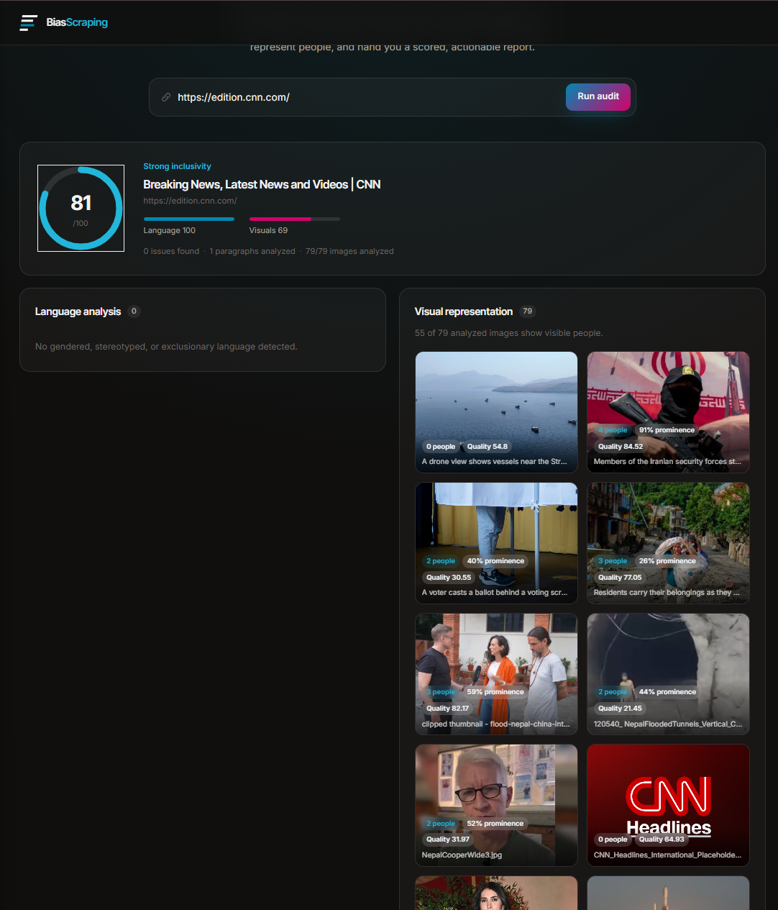
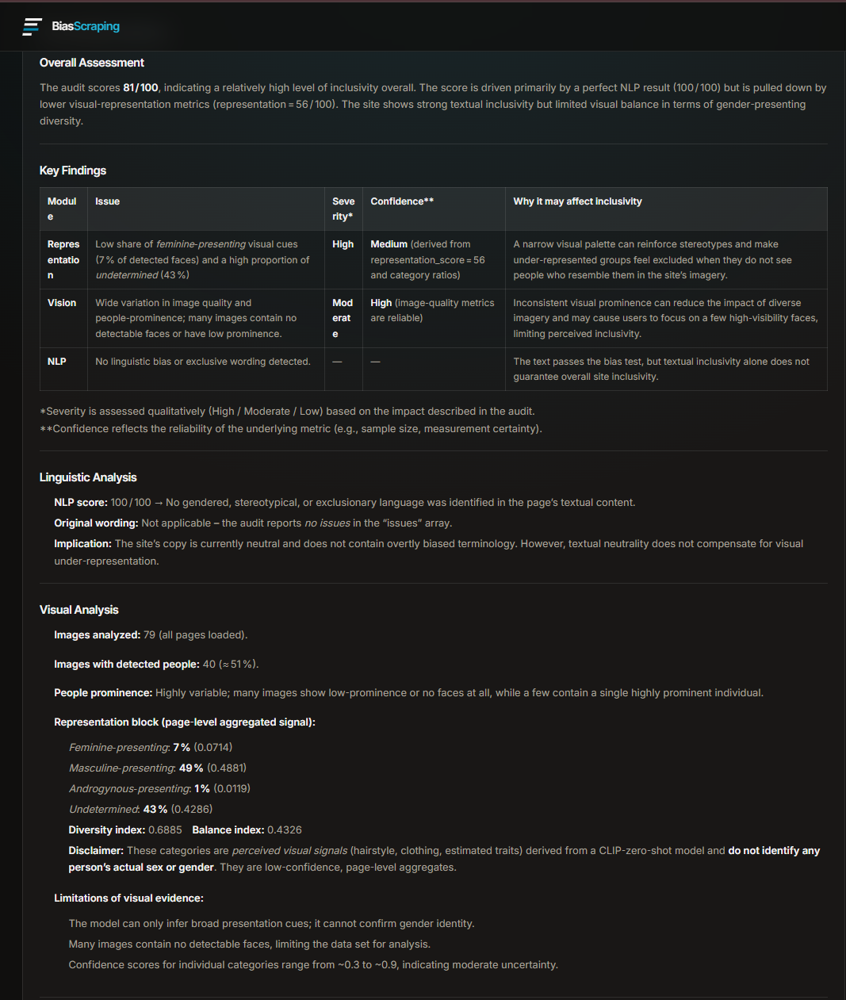
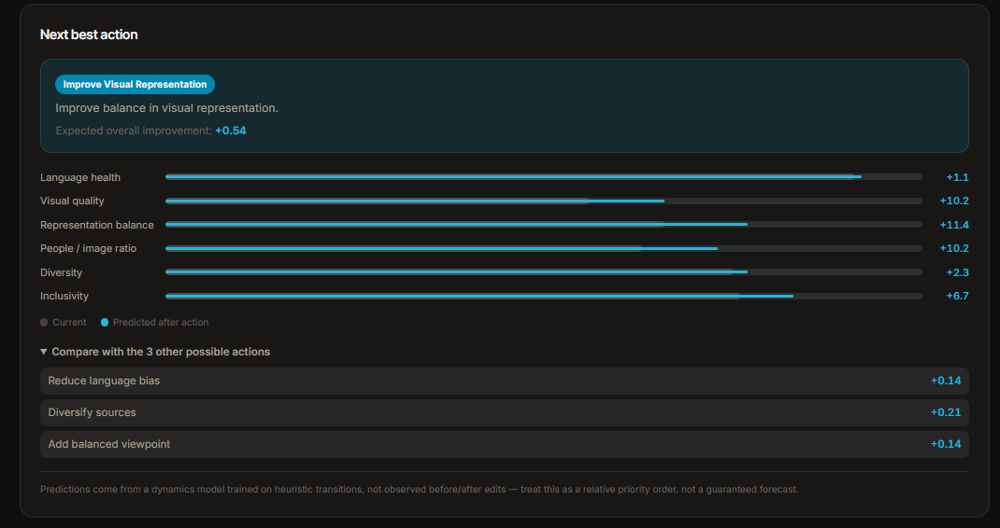
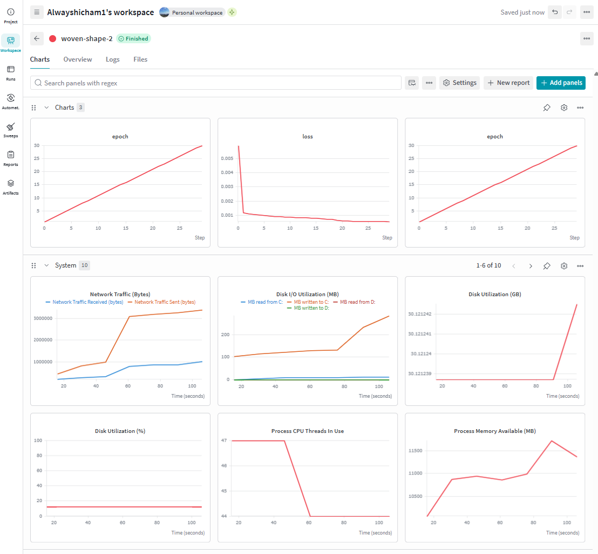

# BiasScraping

Paste a news article URL and get an automated inclusivity audit: gendered or exclusionary
language flagged in the text, visual representation checked in the images, and everything
summarized into a scored report by an LLM — plus a "next best action" suggestion from a small
world model trained on top of the audit results.









## How it works

```
URL ──▶ Scraper ──▶ ┌───────────────────────────────────────────────┐
                     │  NLP      zero-shot bias classification      │
                     │           (bart-large-mnli)                  │
                     │  Vision   person detection (YOLOv11) +       │
                     │           OpenCV image quality +             │
                     │           face detection (YuNet) + CLIP      │
                     │           perceived-presentation signal      │
                     └───────────────────────────────────────────────┘
                            │
                            ▼
                     Report Manager ──▶ score + issues + recommendations
                            │
                            ├──▶ World Model ──▶ recommended next action
                            │
                            ▼
                   LLM orchestrator ──▶ narrative summary (NVIDIA NIM API)
                            │
                            ▼
                     Angular frontend
```

- **Scraping** (`app/scraping_system`) — fetches the page and extracts the article title,
  paragraphs, and images using `trafilatura` + `BeautifulSoup`, filtering out nav/ads/boilerplate.
- **NLP analysis** (`app/nlp`) — classifies each paragraph as neutral or one of
  `gendered_language` / `gender_stereotype` / `exclusionary_language` / `potential_bias` via
  zero-shot classification, scored above a confidence threshold to avoid noise.
- **Vision analysis** (`app/vision`) — detects people with YOLOv11, scores image quality
  (brightness, contrast, sharpness) with OpenCV, detects faces (YuNet) and estimates a coarse,
  page-level *perceived visual presentation* signal per face via CLIP zero-shot classification
  (see `app/vision/presentation_signal.py` — never a claim about a person's real sex or gender),
  then aggregates a diversity/balance score across the whole page.
- **Reporting** (`app/reports`) — merges NLP + vision + representation scores into one weighted,
  explainable inclusivity score (`score_breakdown`, `score_explanation`) and a prioritized list
  of recommendations.
- **World model** (`app/world_model`, `app/services/analysis_for_results.py`) — converts the
  audit into a small normalized state and uses a PyTorch dynamics model + a one-step planner to
  recommend which of 4 actions (reduce language bias, diversify sources, add balanced viewpoint,
  improve visual representation) is likely to improve the score the most. Bootstrapped on
  synthetic transitions (see `app/world_model/simulator/synthetic_data.py`) seeded from real
  states logged after every audit; retrain manually with
  `python -m app.world_model.simulator.train` (tracked on
  [Weights & Biases](https://wandb.ai)).
- **Orchestrator** (`app/orchestrator`) — runs the pipeline end-to-end and asks an LLM (via the
  NVIDIA NIM API) to turn the structured report into a readable narrative summary.
- **API** (`app/api`) — a single FastAPI endpoint tying it all together.
- **Frontend** (`frontend/frontend`) — an Angular 21 app: paste a URL, watch the audit run, see
  the score, flagged issues, an image gallery with detection results, the recommended next
  action, and the AI summary.

## Prerequisites

- Python 3.12
- [uv](https://docs.astral.sh/uv/) (or plain `pip`)
- Node.js 20+ and npm
- An NVIDIA API key from [build.nvidia.com](https://build.nvidia.com) (used for the LLM summary step)

## Backend setup

```bash
# from the repo root
uv sync                                   # or: pip install -e .

cp app/orchestrator/.env.example app/orchestrator/.env
# then edit app/orchestrator/.env and set NVIDIA_API_KEY=<your key>

uv run uvicorn app.main:app --reload --port 8000
```

The API is now at `http://localhost:8000` (`GET /health` to check it's alive).

> First request after starting the server is slow — the bias classifier
> (`facebook/bart-large-mnli`) and the YOLO model are downloaded/loaded on first use.

## Frontend setup

```bash
cd frontend/frontend
npm install
npm start
```

Open `http://localhost:4200`. The dev server proxies `/api/*` to `http://localhost:8000`
(see `proxy.conf.json`), so no CORS setup is needed in development.

## API

```
POST /api/audit
Content-Type: application/json

{ "url": "https://example.com/some-article" }
```

Returns an `AuditReport`: `inclusivity_score`, `score_breakdown`/`score_explanation` (weighted
components behind the score), `summary` (nlp/vision/representation sub-scores), `representation`
(page-level perceived-presentation diversity/balance signal), `issues`, `recommendations`,
`images` (per-image detection + face results), `metadata`, `world_model` (recommended next
action + predicted impact), and `agent_analysis` (the LLM-generated narrative).

## Project structure

```
app/                      FastAPI backend
├── api/                  HTTP routes
├── orchestrator/         Pipeline orchestration + LLM config
├── scraping_system/      Article + image extraction
├── nlp/                  Bias classification
├── vision/               Person/face detection, image quality, presentation signal
├── reports/              Scoring + recommendations
├── world_model/          State, dynamics model, planner, reward, training
├── services/             Wires the world model into an audit report
└── schema/               Request/response models

frontend/frontend/        Angular app (see its own README for CLI details)
```

## Configuration notes

- LLM model is set in `app/orchestrator/config.py` (`nvidia/nemotron-3-nano-30b-a3b` by default —
  chosen for its speed/quality tradeoff on the NVIDIA NIM API; swap it for any model available to
  your API key).
- `NVIDIA_API_KEY` must never be committed — `app/orchestrator/.env` is gitignored,
  `app/orchestrator/.env.example` is the tracked template.
