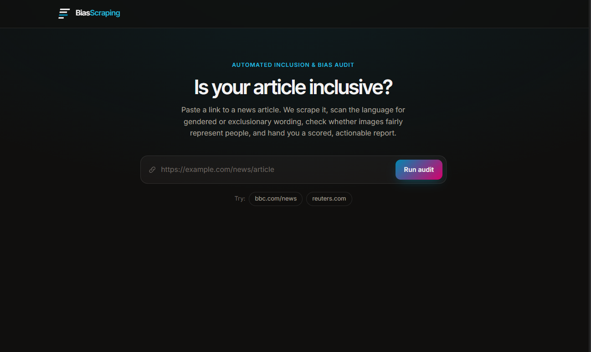
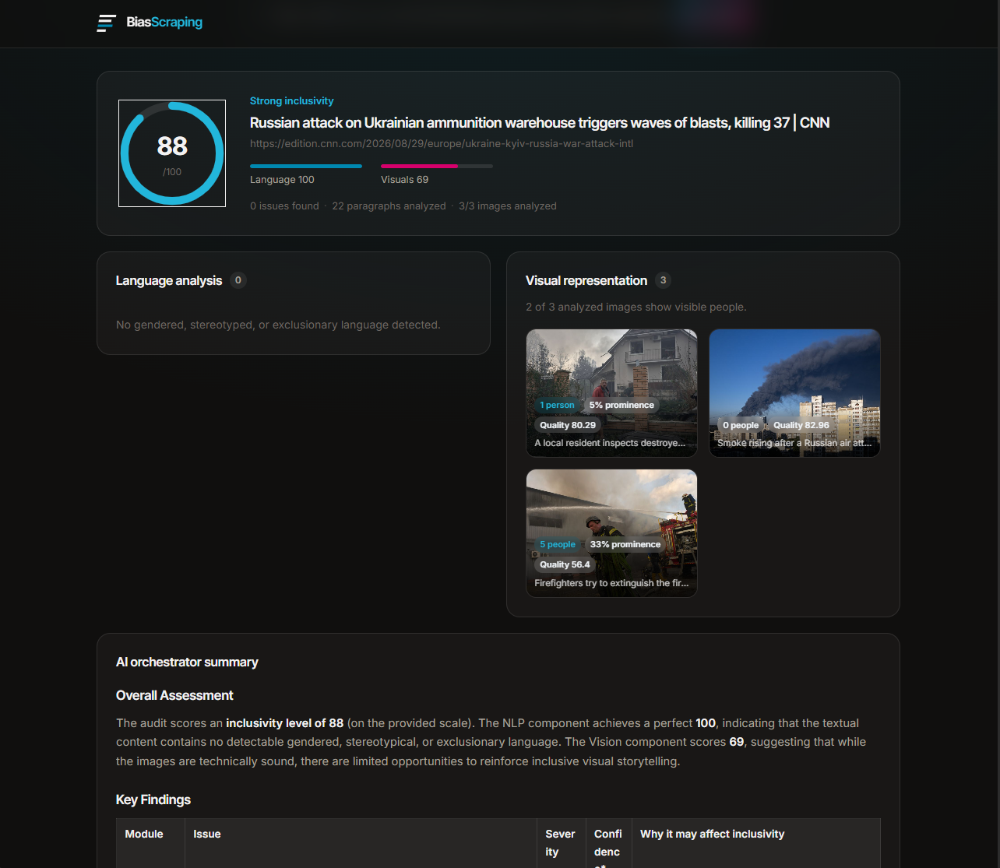
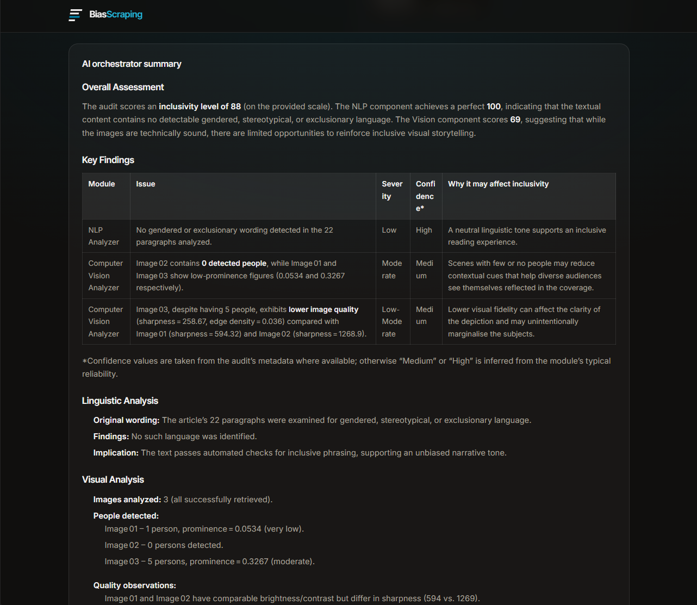

<p align="center">
  
</p>

# BiasScraping

Paste a news article URL and get an automated inclusivity audit: gendered or exclusionary
language flagged in the text, visual representation checked in the images, and everything
summarized into a scored report by an LLM.







## How it works

```
URL ──▶ Scraper ──▶ ┌─────────────┐
                     │  NLP        │  zero-shot bias classification (bart-large-mnli)
                     │  Vision     │  person detection (YOLOv11) + OpenCV image quality
                     └─────────────┘
                            │
                            ▼
                     Report Manager ──▶ score + issues + recommendations
                            │
                            ▼
                   LLM orchestrator ──▶ narrative summary (NVIDIA NIM API)
                            │
                            ▼
                     Angular frontend
```

- **Scraping** (`app/scraping_system`) — fetches the page and extracts the article title,
  paragraphs, and images using `trafilatura` + `BeautifulSoup`, filtering out nav/ads/boilerplate.
- **NLP analysis** (`app/nlp`) — classifies each paragraph as neutral or one of
  `gendered_language` / `gender_stereotype` / `exclusionary_language` / `potential_bias` via
  zero-shot classification, scored above a confidence threshold to avoid noise.
- **Vision analysis** (`app/vision`) — detects people with YOLOv11 and scores image quality
  (brightness, contrast, sharpness) with OpenCV, then combines both into a per-image result.
- **Reporting** (`app/reports`) — merges NLP + vision output into one inclusivity score and a
  prioritized list of recommendations.
- **Orchestrator** (`app/orchestrator`) — runs the pipeline end-to-end and asks an LLM (via the
  NVIDIA NIM API) to turn the structured report into a readable narrative summary.
- **API** (`app/api`) — a single FastAPI endpoint tying it all together.
- **Frontend** (`frontend/frontend`) — an Angular 21 app: paste a URL, watch the audit run, see
  the score, flagged issues, an image gallery with detection results, and the AI summary.

## Prerequisites

- Python 3.12
- [uv](https://docs.astral.sh/uv/) (or plain `pip`)
- Node.js 20+ and npm
- An NVIDIA API key from [build.nvidia.com](https://build.nvidia.com) (used for the LLM summary step)

## Backend setup

```bash
# from the repo root
uv sync                                   # or: pip install -e .

cp app/orchestrator/.env.example app/orchestrator/.env
# then edit app/orchestrator/.env and set NVIDIA_API_KEY=<your key>

uv run uvicorn app.main:app --reload --port 8000
```

The API is now at `http://localhost:8000` (`GET /health` to check it's alive).

> First request after starting the server is slow — the bias classifier
> (`facebook/bart-large-mnli`) and the YOLO model are downloaded/loaded on first use.

## Frontend setup

```bash
cd frontend/frontend
npm install
npm start
```

Open `http://localhost:4200`. The dev server proxies `/api/*` to `http://localhost:8000`
(see `proxy.conf.json`), so no CORS setup is needed in development.

## API

```
POST /api/audit
Content-Type: application/json

{ "url": "https://example.com/some-article" }
```

Returns an `AuditReport`: `inclusivity_score`, `summary` (nlp/vision sub-scores), `issues`,
`recommendations`, `images` (per-image detection results), `metadata`, and `agent_analysis`
(the LLM-generated narrative).

## Project structure

```
app/                      FastAPI backend
├── api/                  HTTP routes
├── orchestrator/         Pipeline orchestration + LLM config
├── scraping_system/      Article + image extraction
├── nlp/                  Bias classification
├── vision/               Person detection + image quality
├── reports/              Scoring + recommendations
└── schema/               Request/response models

frontend/frontend/        Angular app (see its own README for CLI details)
```

## Running with Docker

```bash
cp app/orchestrator/.env.example app/orchestrator/.env
# edit app/orchestrator/.env and set NVIDIA_API_KEY=<your key>

docker compose up --build
```

- Frontend (nginx, static build): `http://localhost`
- Backend (FastAPI): `http://localhost:8000`

The frontend container proxies `/api/*` to the backend container over the Docker network
(see `frontend/frontend/nginx.conf`), so the browser only ever talks to one origin.

The bias classifier model (`facebook/bart-large-mnli`, ~1.6 GB) is cached in a named volume
(`hf-cache`) so it's only downloaded once, on the first `/api/audit` call, not on every
container restart.

## Documentation

- [`docs_architecture/achitecture.md`](docs_architecture/achitecture.md) — request lifecycle, module responsibilities, deployment
- [`docs_architecture/api.md`](docs_architecture/api.md) — full `POST /api/audit` request/response reference
- [`docs_architecture/ml_pipelines.md`](docs_architecture/ml_pipelines.md) — NLP classifier, vision pipeline, and LLM step details

## Configuration notes

- LLM model is set in `app/orchestrator/config.py` (`nvidia/nemotron-3-nano-30b-a3b` by default —
  chosen for its speed/quality tradeoff on the NVIDIA NIM API; swap it for any model available to
  your API key).
- `NVIDIA_API_KEY` must never be committed — `app/orchestrator/.env` is gitignored,
  `app/orchestrator/.env.example` is the tracked template.
